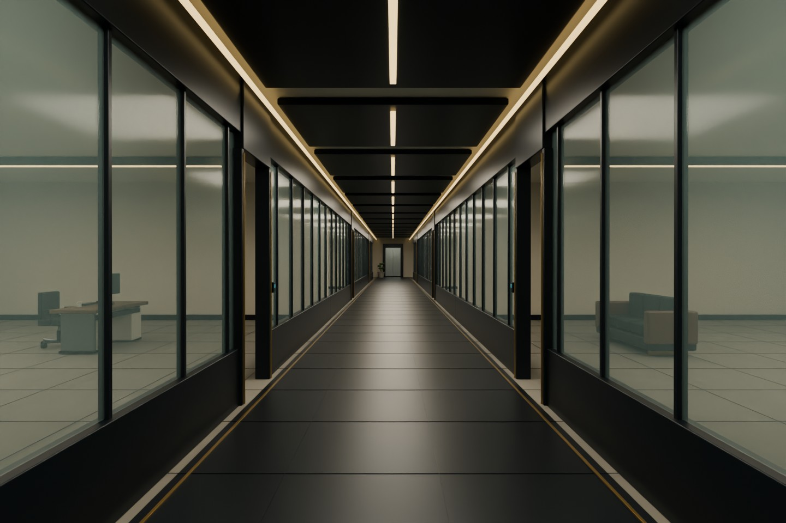
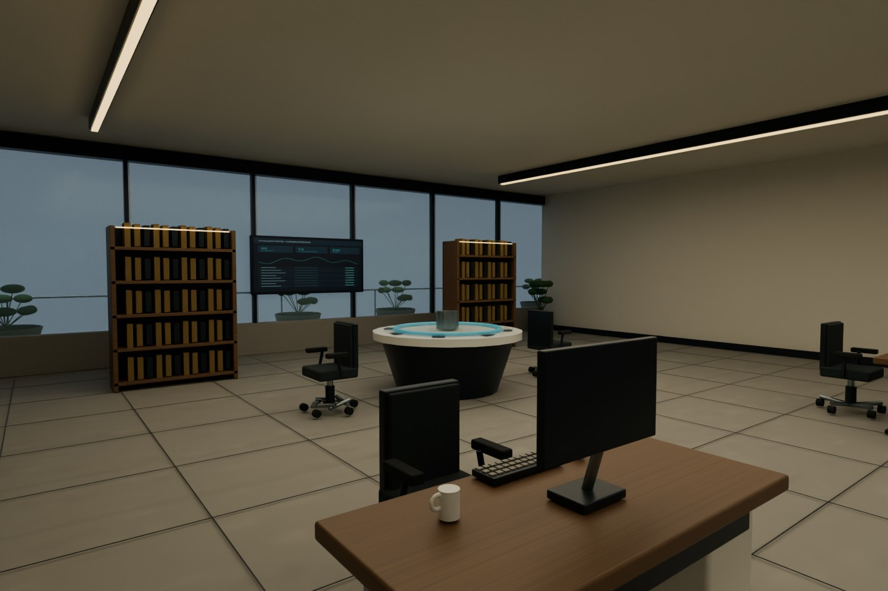
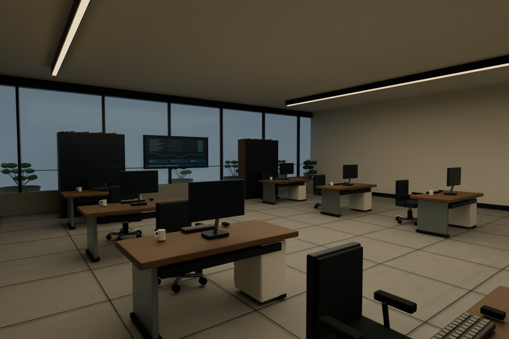
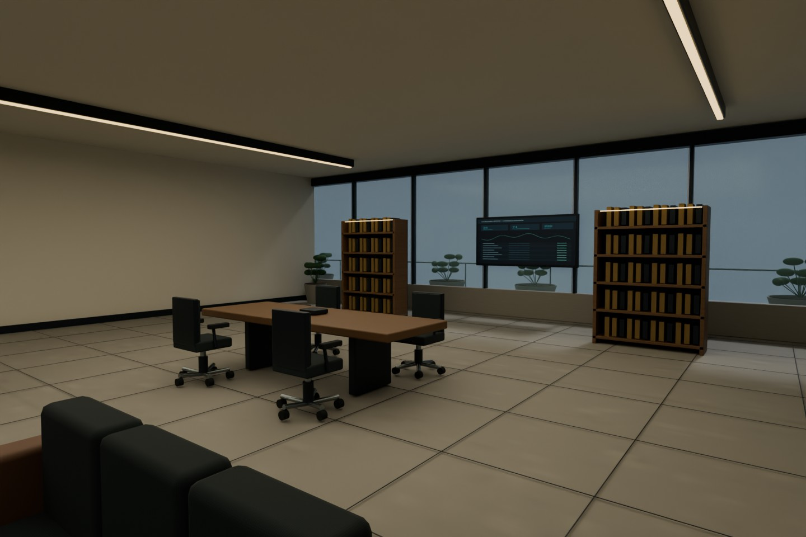
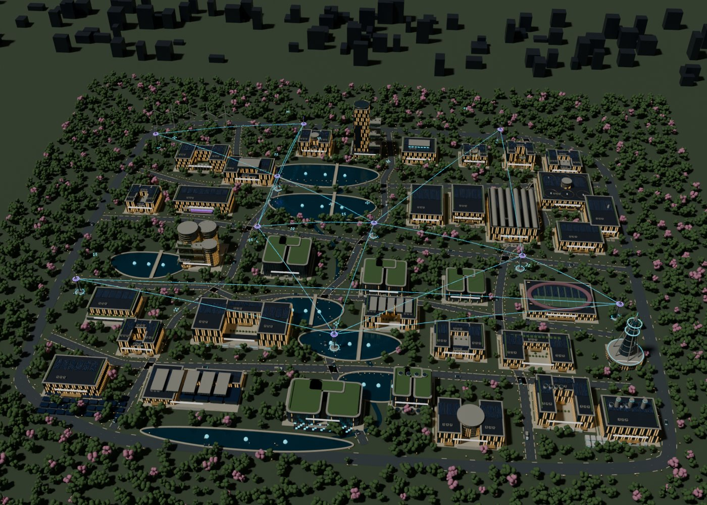
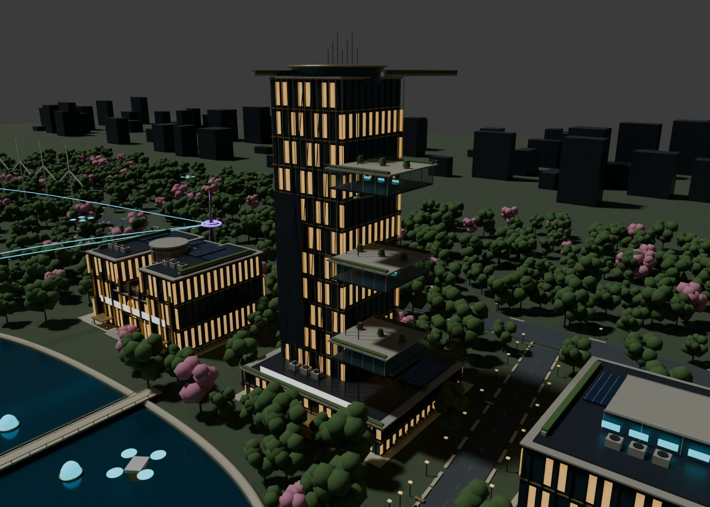

# PR 8 reconstruction and validation

## Scope and source precedence

PR 7 is merged. This work continues from `f04f926b1c6eba4bb5af500f32e7ca2e15ab1482` on a new branch. The user explicitly selected: full-campus artwork for placement; CF-01–35 infographics for architecture and visible interiors; realistic interpretation of unseen rooms. The source ZIP was retrieved and all 35 facility images reviewed in contact sheets, with detailed inspection of CF-30 and the full activated campus artwork.

All 35 facilities, 74 floor programs, 444 room zones, exterior positions, energy routes and autonomous fleets are preserved. CF-24/25 area assumptions remain identified.

## Changes

- Correct the reciprocal hardware-scaling error. At DPR 3 the old interior formula yielded 0.5 rendered pixels per CSS pixel; balanced now yields 1.5 and high yields 2. Hardware performance is not inferred from these values.
- Replace primitive slab fixtures with joined multi-part furniture: bevelled worktops, supports, storage pedestals, five-caster chairs, armrests, monitor stands, keyboards, mouse, cups, ventilated server racks, records shelving, demonstration tables, lab equipment, growing racks, dining, teaching and fitness fixtures.
- Glazed corridor partitions, door readers, brass reveals, coffered ceiling, acoustic timber, jointed floors, planted terraces and room-specific furniture placement.
- Babylon PBR materials with deterministic surface textures; local room lights, daylight fill, environment reflection and one nearest-room shadow map. Geometry is merged by material within each room to limit draw calls. It still requires GPU performance testing.
- Facility-infographic silhouettes replace conflicting aerial families for Prism, Trust Vault, curved research wings, rooftop athletic field, logistics landing pads and courtyard facilities. The new exterior remains an approximation rather than an identical reconstruction.
- Compact/collapsible interior navigation, hide the large caption after campus interaction, selectable rendering quality, device-local performance report downloads.

## Automated checks

`npm test`: **10 tests pass**, including construction/disposal of all 74 Babylon floors in NullEngine, finite exterior geometry/picking IDs for all 35 facilities, preservation of the register, high-DPR render budgets, detailed fixture parts and ray-tested clear guided arrival paths for the six CF-30 L01 rooms.

`npm run build`: **passes**. Vercel reported the implementation deployment READY for commit `efc11c334500725beddf4801720ccc061177864e`.

NullEngine does not compile browser GPU shaders, validate transparency/shadow rendering or measure hardware frame times. The clear-path test uses an eye-height ray, not a complete swept-body collision proof.

## Render evidence and corrections

`interior-30-*.jpg`: Blender Cycles review of the exact shared interior geometry, rendered at 1440 × 960 with 20 samples and denoising. Albedo texture pixels come from the same surface painter as Babylon. Blender uses area lights/Cycles, not the browser's spot lights/PBR implementation. These are **offline geometry reviews**, not screenshots of the app.

`offline-aerial.jpg`, `offline-north.jpg`, `offline-prism.jpg`, `offline-eden.jpg`: updated exterior geometry review. The export strips runtime canvas textures and does not reproduce animated water, Three.js sky/tone mapping, separately loaded synergy GLBs or UI. It must not be used to claim browser likeness.

First interior review identified duplicate coplanar partitions (black surfaces), sparse workstations, reversed records shelving and a plant/shelf overlap. Corrections removed duplicate walls, populated work bays, oriented shelves inward, and removed the overlapping planters. The offline texture orientation was corrected separately; that change does not alter browser materials.

## Actual browser findings

The production site was opened in the provided Chrome. Console evidence: `GL_VENDOR = Disabled, GL_RENDERER = Disabled`, followed by a WebGL context-creation failure. The GPU-independent fallback map rendered, consistent with PR 7. This proves neither the new exterior nor new interior browser rendering.

The PR 8 preview was opened from Vercel's GitHub deployment comment. It redirects this browser to Vercel login. No preview-protection setting was changed. Localhost access from this browser returned `ERR_BLOCKED_BY_CLIENT`. No desktop/mobile GPU screenshot comparison is claimed. The four user-supplied screenshots show the old implementation, not this PR.

## Acceptance still open

**Not identical. Not certified photorealistic. Keep draft.**

- Actual desktop and mobile WebGL rendering, shader/transparency/shadow behavior, tours, repeated entry/exit, touch movement and context-loss recovery need a GPU-capable browser.
- Per-facility matched-angle comparisons against all 35 infographics remain outstanding. Facade detail, landscape realism, equipment fidelity, material response and inferred interiors still differ.
- Physical Galaxy A15 performance, thermal behavior, memory pressure and final reference acceptance have not been tested.

See `GALAXY-A15-VALIDATION.md` for a reproducible capture route. No fabricated frame rate, device pass or visual score is supplied.

## Review gallery

These images are offline Blender renders of the shipped geometry; their lighting differs from the app.

Observed residual mismatch: repetitive facade glazing, simplified vegetation and skyline, sparse architectural ornament, approximate glass/lighting response and schematic room envelopes. The offline geometry is visibly more developed than the supplied current-state screenshots, but does not reproduce the facility illustrations identically.
